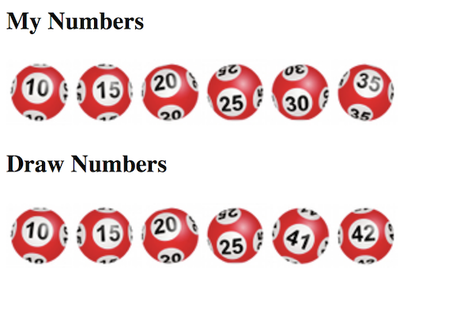

# JavaScript Exercise 1 -- Fundamentals


## Clone the Remote Repository

1.	Accept the GitHub Classroom invitation to this exercise [here]()

1.	Copy the clone URL from your new repository ``JavaScript-<YOURACCOUNT>``

1.	Type these commands into your *Git Bash* client:

	```
	$ cd /<DRIVE>/xampp/htdocs   
	$ git clone <URL> JavaScript
	$ cd JavaScript
	$ ls
	$ git status

	```

Check your ``htdocs`` folder.  You should have a new folder called ``JavaScript`` with some files in it.


## Part 1 – Hello JavaScript

1.	Edit using the *Sublime Text Editor* the HTML file called ``FirstJS.html`` in your ``JavaScript`` folder.  Examine the code carefully and then open it in your browser using the URL [http://localhost/JavaScript/FirstJS.html](http://localhost/JavaScript/FirstJS.html).

1.	Always try to keep the JavaScript separate from the HTML.

	Edit the file ``SecondJS.html`` and add to it the code shown here:

	```html
	<!doctype html>
	<html>
	<head>
		<title>Second JavaScript</title>
		<script type="text/javascript" src="example.js"></script>
	</head>

	<body>
	Now you see me...
	</body>
	</html>
	
	```

	Edit the file ``example.js`` and add to it the code shown here:

	```java
	alert("hello from example.js");
	console.log("hello,console!");
	
	```
		
	Save the files and view in your browser using the URL [http://localhost/JavaScript/SecondJS.html](http://localhost/JavaScript/SecondJS.html)

	

## Part 2 – Fundamentals

1.	Edit the files ``fundamentals.html`` and ``fundamentals.js``.  You are going to use these files to review the JavaScript code fundamentals.  Make sure you **open the console window**.

1.	In ``fundamentals.html`` uncomment the function call to ``part1()``.  Modify the function ``part1()`` in ``fundamentals.js`` to:
	
	-	print the following to the console window:

		```
		-- part1 --
		first name=Tom
		last name=Jones
		full name=Tom Jones

		``` 

1.	In ``fundamentals.html`` uncomment the function call to ``part2()``.  Modify the function ``part2()`` in ``fundamentals.js`` to:

	-	print the following to the console window:

		```
		-- part2 --
		celsius=0
		0 celsius = 32 fahrenheit

		```

1.	In ``fundamentals.html`` uncomment the function call to ``part3()``.  Modify the function ``part3()`` in ``fundamentals.js`` to:

	-	print the following to the console window when a grade of 30 is input:

		```
		-- part3 --
		mark = 30
		Fail

		```

		Your code should handle any mark input and print the appropriate grade for the given mark.

		| Grade	      | Mark    |
		|-------------|---------|
		| Distinction |	70–100  |
		| Merit 1 	  | 60–69   |
		| Merit 2 	  | 50–59   |
		| Pass 		  | 40–49   |
		| Fail 		  | 0–39    |
		

		Print *Invalid Mark* for any invalid mark input.


1.	In ``fundamentals.html`` uncomment the function call to ``part4()``.  Modify the function ``part4()`` in ``fundamentals.js`` to:

	-	print the following 5 times table to the console window:

		```
		-- part4 --
		5 x 1 = 5
		5 x 2 = 10
		5 x 3 = 15
		5 x 4 = 20
		5 x 5 = 25
		5 x 6 = 30
		5 x 7 = 35
		5 x 8 = 40
		5 x 9 = 45
		5 x 10 = 50
		5 x 11 = 55
		5 x 12 = 60

		```

1.	In ``fundamentals.html`` uncomment the function call to ``part5()``.  Modify the function ``part5()`` in ``fundamentals.js`` to:

	-	print the following to the console window :

		```
		-- part5 --
		3 squared = 9

		```

		Call the function ``sqr()`` in your solution.


1.	In ``fundamentals.html`` uncomment the function call to ``part6()``.  Modify the function ``part6()`` in ``fundamentals.js`` to:

	-	print the ``lotto`` array to the console window:

		```
		-- part5 --
		My Lotto numbers:
		10
		15
		20
		25
		30
		35

		```

	-	and print the ``draw`` array to the console window:

		```
		My Lotto numbers:
		10
		15
		20
		25
		30
		35
		Lotto Draw numbers:
		10
		15
		20
		25
		41
		42

		```

	-	and finally check the ``draw`` numbers against your ``lotto`` numbers for matches. The program should print either *Match 6* or *Match 5* or *Match 4* or *Not a winner*. The completed output for the array values given would be:

		```
		My Lotto numbers:
		10
		15
		20
		25
		30
		35
		Lotto Draw numbers:
		10
		15
		20
		25
		41
		42

		Match 4

		```

1.	In ``fundamentals.html`` uncomment the function call to ``part7()``.  Modify the function ``part7()`` in ``fundamentals.js`` to print the ``draw`` images like this:

	
